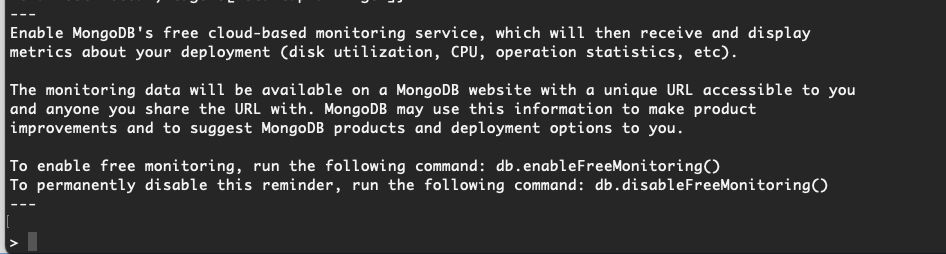
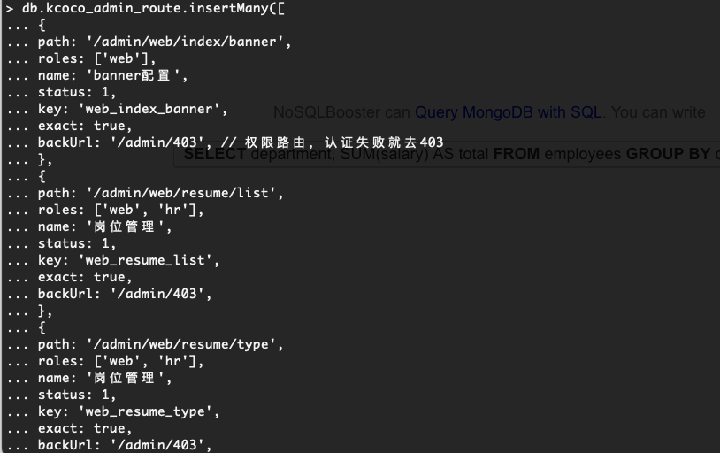
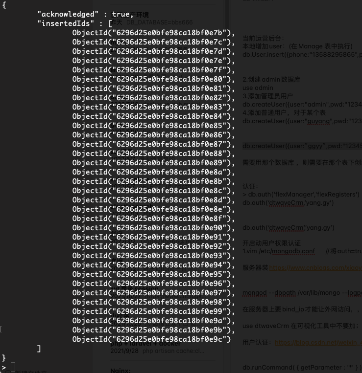
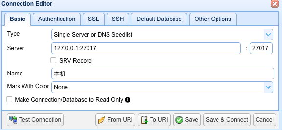
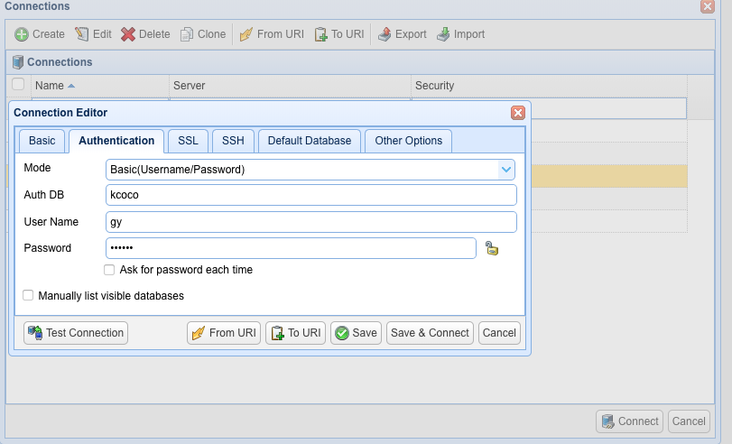
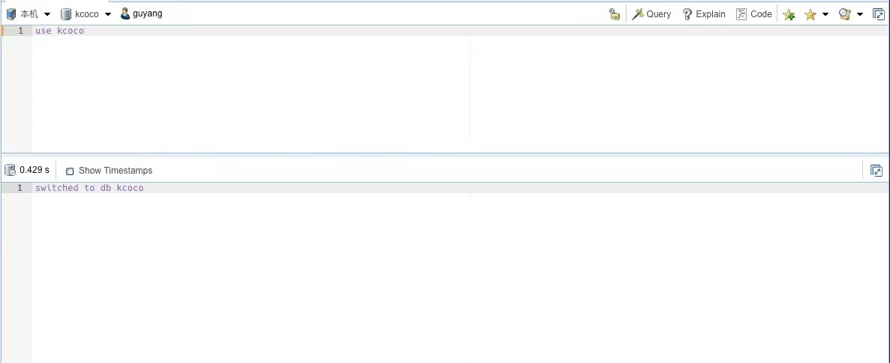
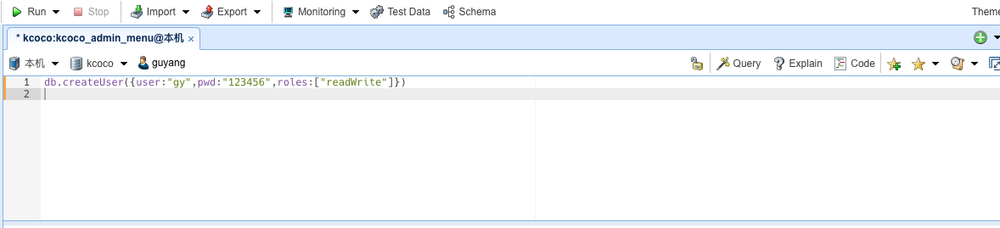
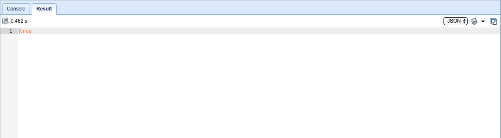

- ### mongodb 语法接近js
    1、直接到数据库管理工具执行即可。
    2、命令行
        a、登录mongodb命令行
        b、数据量不大的直接复制到命令行执行，数据量大的用mongoimport命令导入
- ### 查看本地sql语句执行日志
  cd logs
  tail -1000f mongodb.log
  
- ### 数据初始化
  #### 前置
  1、mongodb数据库安装： 安装过程因为操作系统不同而不同，但是都较为简单，这里略过（请自行百度相关资料，如菜鸟教程）
    如果了解并会使用docker，推荐使用docker安装
  2、数据库连接测试，创建相关数据库和用户密码
  3、数据库可视化工具：
     推荐2款工具：NoSQLBooster for MongoDB 、Robo 3T
  #### 命令行导入数据
    1、命令行登录mongodb(查看mongodb教程)，这里以我本机为例（如果是docker安装，需要进入容器执行）
    ```
    which mongo  // 输出你的mongodb安装目录，进入bin目录
    cd xxxx/bin
    ./mongo     // 不出意外，以进入命令行模式
    ```
    成功进入命令行模式界面如下：
    
    2、使用或创建指定数据库（在命令行模式下）
    ```
    use kcoco    // 使用（创建）数据库kcoco
    ```
    3、直接将/sql/sql/下的js文件内容复制到命令行，敲回车即可（如何内容太多，可能执行会失败，此时需要用mongodbimport命令执行）
    
    执行成功界面：
    
    4、将/sql/sql/下的所以js文件，复制内容，重复步骤3，导入全部数据
  
  #### 可视化工具导入(以 NoSQLBooster for MongoDB 为例)
    1、设置数据库连接参数，点击可视化工具左上角Connect->+Create,添加连接设置
    
    
    设置完毕，点击Connect即可
    2、点击SQL窗口，创建（切换）数据库（注意：kcoco后面不要加;(分号),不然就是"kcoco;"，首次创建空文档的数据库会不显示，待插入数据后刷新即可显示）
    ```
     use kcoco
    ```
    点击Run（执行sql）
    
    3、直接将/sql/sql/下的js文件内容复制到SQL窗口，点击Run执行，刷新数据库即可看到导入的数据
    4、将/sql/sql/下的所以js文件，复制其内容，重复步骤3，即可导入全部数据
    
  #### mongodb命令导入
  1、进入sql目录，使用export数据直接倒入数据库（前提你已经创建好kcoco和其管理员）
  1.1 利用可视化工具创建数据库和管理员
  
  创建用户
  
  
  
  2、使用mongorestore导入sql
  ```
  cd /sql
  ```
  
  ```
  mongorestore -d kcoco -u gy -p 123456 --drop ./export
  ```
    
  #### 使用脚本自动插入数据
  执行脚本之前务必请先确认数据库已安装且数据库服务已开启，数据库管理员账号已注册且能正确访问对应数据库
  将/scripts/excuteSql/insert.sh中数据库连接参数修改为你自己本地数据库的参数，然后在项目根目录（注意：是根目录）执行npm run insert
  ```
  npm run insert
  ```

- ### mongodb 导入/导入
  - mongodbdump -h ip --port 端口 -u 用户名 -p 密码 -d 数据库 -o 存放路径
  - mongodbstore -h ip --port 端口 -u 用户名 -p 密码 -d 数据库 --drop 文件路径
  - mongodbexport -h ip --port 端口 -u 用户名 -p 密码 -d 数据库 -c 表名 -f 字段 -q 条件 --type=文件格式 -o 文件名字
  - mongodbimport -h ip --port 端口 -u 用户名 -p 密码 -d 数据库 -c 表名 --type 类型 文件名
  当ip、端口、用户、密码为默认时，可省略。更多用法，请使用 --help 查看相关命令用法
    
  #### 举例（以上面数据库名和账号密码为例）
  - 导出kcoco整库数据
  ```
  mongodump  -u gy -p 123456 -d kcoco -h localhost -o ./export
  ```
  - 导入整库数据（以上面导出为例）--drop，先删除所有的记录，然后执行
  ```
  mongorestore -d kcoco -u gy -p 123456 --drop ./export
  ```
  - 导出单表
  ```
  mongoexport --port 27017 -h localhost -u gy -p 123456 -d kcoco -c kcoco_admin_menu --type=json -o adminMenu.json --forceTableScan
  ```
  - 导入单表 --upsert，插入或者更新现有数据
  ```
  mongoimport --port 27017 -h localhost -u gy -p 123456 -d kcoco -c kcoco_admin_menu --type=json --file --upsert --drop ./adminMenu.json
  ```
